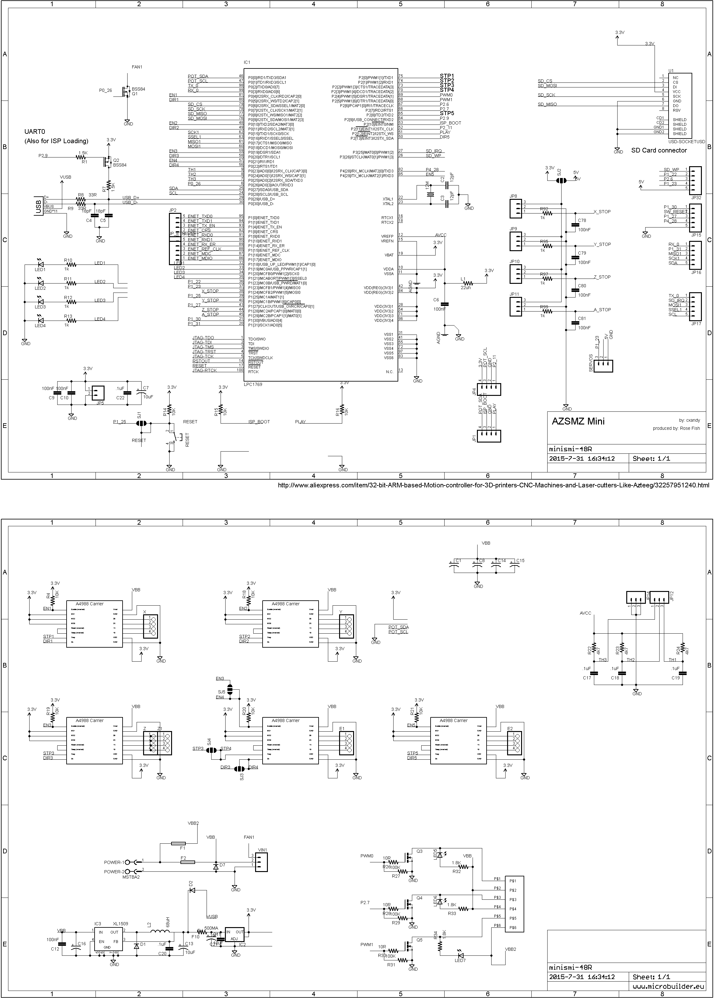
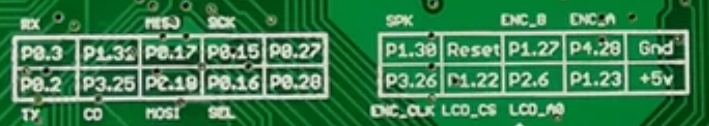

### Board plan

### Video how to flash
https://youtu.be/KnbINGOdyMw

### Firmware
https://github.com/Smoothieware/Smoothieware/tree/edge/FirmwareBin

### Configuration
https://3dtoday.ru/blogs/dagov/smoothieware-configure-delta/
https://github.com/Smoothieware/Smoothieware/tree/edge/ConfigSamples/Smoothieboard.delta

### Hints towards Mini Panel
https://3dtoday.ru/blogs/davlenec/how-to-make-mks-mini12864lcd-and-repetierfirmware/

https://wiki.fysetc.com/Mini12864_Panel/

### Panel with RAMPS Pin assignment:

### AZSMZ Board connector:

### Mapping
~~~
EXP-1:

A1.VCC           | +5v      #A1
A3.BLUE          | P1.23    #B8 panel.a0_pin 1.23
A5.RED           | P2.6     #B7 panel.click_button_pin 2.6!^
A7.LCD_A0        | P1.22    #A3 panel.encoder_b_pin 1.22!^
A9.BTN_ENC       | P3.26    #A5 panel.encoder_a_pin 3.26!^

A2.GND           | Gnd      #A2
A4.GREEN         | 4.28     #A0  panel.rst_pin 4.28
A6.LCD_RST       | 1.27     #A4  panel.spi_cs_pin 1.27
A8.LCD_CS        | Reset    #A6
A0.BEEP          | 1.30     #NC

EXP-2:

B1.KILL          | 0.28     #NC
B3.RST           | 0.16     #A8  
B5.MOSI          | 0.18     #B5
B7.SS            | 3.25     #NC
B9.SCK           | 0.2      #B4  panel.spi_channel 0

B2.GND           | 0.27     #NC  
B4.CD            | 0.15     #B1
B6.BTN_EN2       | 0.17     #A7
B8.BTN_EN1       | 1.31     #A9
B0.MISO          | 0.3      #B6
~~~
### Smoothie config.txt
~~~
panel.enable true # set to true to enable the panel code
panel.lcd viki2 # set type of panel
panel.spi_channel 0 # set spi channel to use P0_18,P0_15 MOSI,SCLK
panel.spi_cs_pin 1.27 # set spi chip select
panel.a0_pin 1.23 # st7565 needs an a0
panel.rst_pin 4.28
panel.encoder_a_pin 3.26!^  # encoder pin
panel.encoder_b_pin 1.22!^  # encoder pin
panel.click_button_pin 2.6!^ # click button
panel.contrast 9 # some panels need contrast set
panel.encoder_resolution 4 # number of clicks to move 1 item
panel.menu_offset 0 # some panels will need 1 here
panel.reverse 1

switch.green_led.enable
switch.green_led.output_pin 1.30
switch.green_led.output_type pwm
switch.green_led.startup_value 255

switch.blue_led.enable
switch.blue_led.output_pin 1.31
switch.blue_led.output_type pwm
switch.blue_led.startup_value 255

switch.red_led.enable
switch.red_led.output_pin 3.25
switch.red_led.output_type pwm
switch.red_led.startup_value 255
~~~

[Datasheet LPC1769_68_67_66_65_64_63](smoothieware_attachments/LPC1769_68_67_66_65_64_63.pdf)